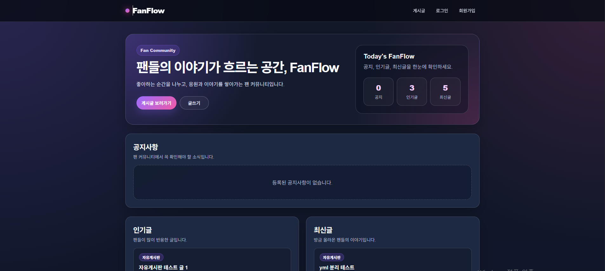
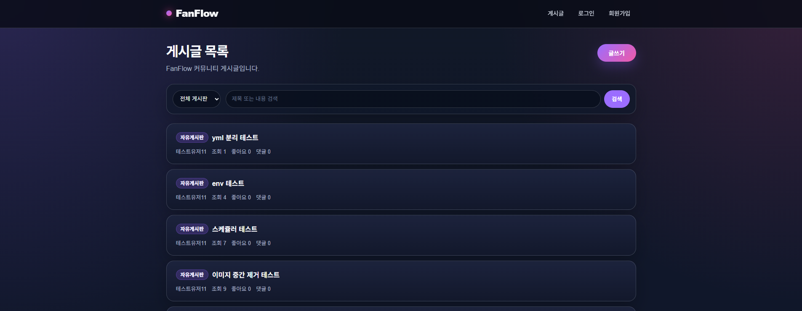
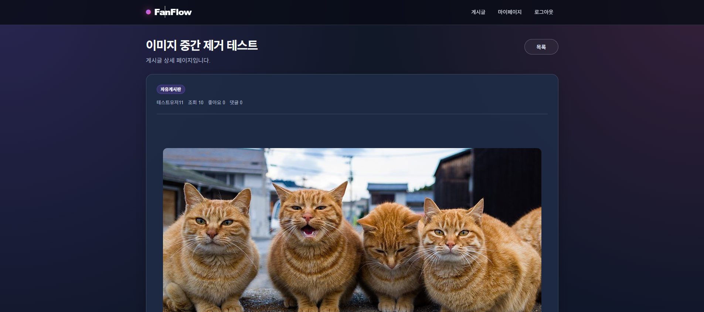
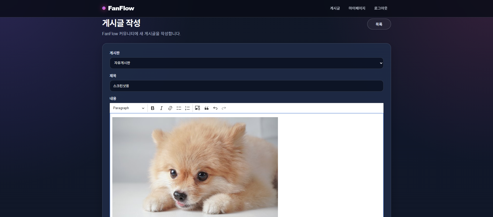
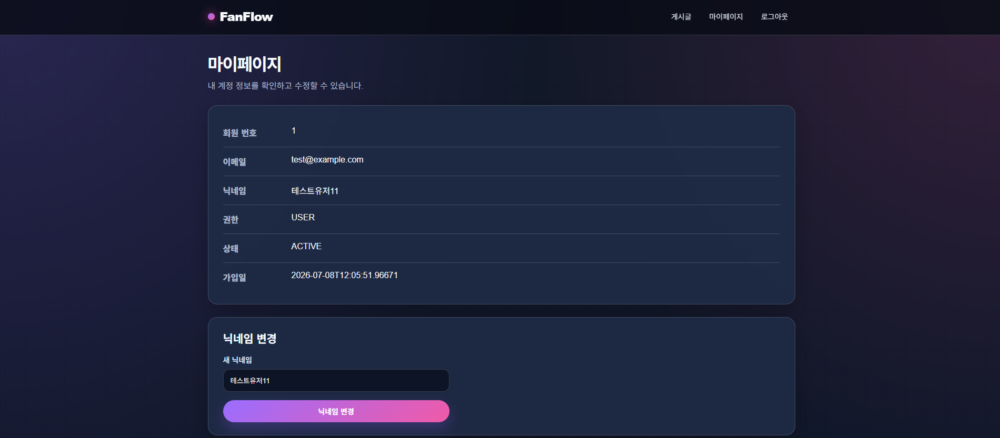
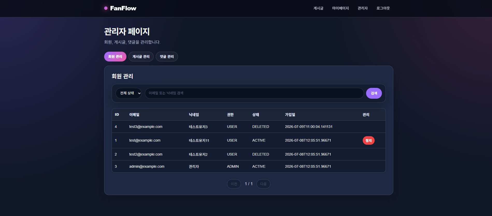
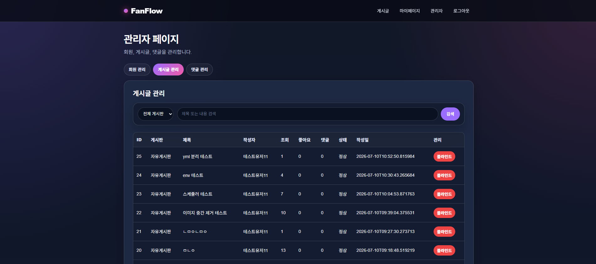
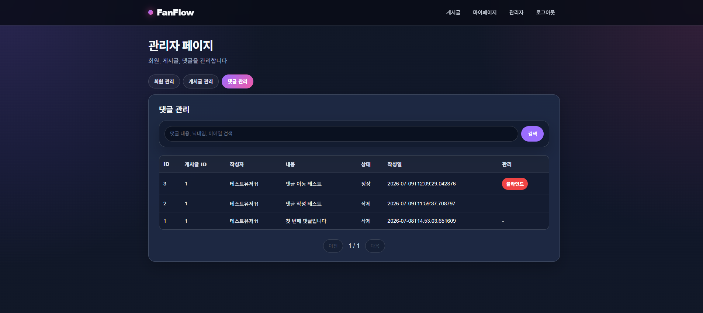

# FanFlow

FanFlow는 스트리머와 팬 커뮤니티를 위한 게시판 기반 팬사이트 프로젝트입니다.
사용자는 게시글 작성, 댓글, 좋아요 기능을 통해 커뮤니티 활동을 할 수 있으며, 관리자는 회원, 게시글, 댓글을 관리할 수 있습니다.

## 프로젝트 개요

FanFlow는 팬 커뮤니티 운영에 필요한 기본 기능을 제공하는 웹 애플리케이션입니다.

주요 목표는 다음과 같습니다.

* 스트리머 팬 커뮤니티 게시판 제공
* 게시글, 댓글, 좋아요 기반의 커뮤니티 기능 구현
* JWT 기반 로그인/인증 처리
* 관리자 페이지를 통한 회원 및 콘텐츠 관리
* 블라인드/삭제 상태 관리를 통한 운영 기능 제공
* React 기반 프론트엔드와 Spring Boot 기반 백엔드 분리 구조 구성
* CKEditor 기반 리치 텍스트 게시글 작성 및 이미지 업로드 지원
* 업로드 이미지 검증, XSS 방어, 미사용 이미지 정리 정책 적용
* 메인 페이지에서 공지, 인기글, 최신글, 댓글 많은 글 제공

## 기술 스택

### Backend

* Java 17
* Spring Boot
* Spring Security
* JWT
* Spring Data JPA
* jsoup
* Spring Scheduler
* MariaDB
* Gradle 또는 Maven

### Frontend

* React
* Vite
* React Router
* Axios
* CKEditor 5
* CSS

### Database

* MariaDB

## 주요 기능

## 1. 회원 기능

* 회원가입
* 로그인
* JWT 기반 인증
* 로그아웃
* 내 정보 조회
* 닉네임 변경
* 비밀번호 변경
* 회원 탈퇴

## 2. 게시글 기능

* 게시글 목록 조회
* 게시판별 게시글 필터링
* 게시글 검색
* 게시글 상세 조회
* CKEditor 기반 게시글 작성
* 게시글 본문 이미지 업로드
* 이미지 포함 게시글 상세 렌더링
* 이미지 정렬 및 본문 여백 처리
* 이미지만 포함된 게시글 작성 허용
* 게시글 수정
* 게시글 삭제
* 조회수 표시
* 댓글 수 표시
* 좋아요 수 표시

## 3. 댓글 기능

* 댓글 목록 조회
* 댓글 작성
* 본인 댓글 삭제
* 블라인드 댓글 일반 사용자 화면 비노출
* 삭제 댓글 일반 사용자 화면 비노출

## 4. 좋아요 기능

* 게시글 좋아요
* 좋아요 취소
* 내 좋아요 상태 조회
* 좋아요 수 실시간 반영

## 5. 이미지 업로드 및 본문 보안

* CKEditor 이미지 업로드 지원
* 이미지 확장자 제한
* 이미지 Content-Type 제한
* 이미지 용량 제한
* 5MB 초과 이미지 업로드 차단
* 업로드 실패 메시지 처리
* jsoup 기반 HTML Sanitizer 적용
* XSS 위험 요소 제거
  * script 태그 제거
  * onerror, onclick 등 이벤트 속성 제거
  * javascript: 링크 제거
* 게시글 삭제 시 본문 이미지 파일 삭제
* 게시글 수정 시 본문에서 제거된 이미지 파일 삭제
* 글 작성 중 업로드 후 저장되지 않은 미사용 이미지 정리
* 스케줄러 기반 임시 이미지 정리

## 6. 메인 페이지

* 팬 커뮤니티 소개 영역 제공
* 공지사항 게시글 표시
* 인기글 표시
* 최신글 표시
* 댓글 많은 글 표시
* 게시글 목록 및 글쓰기 페이지 이동


## 7. 마이페이지

* 내 계정 정보 조회
* 닉네임 변경
* 비밀번호 변경
* 회원 탈퇴
* 내가 쓴 게시글 조회
* 내가 쓴 댓글 조회
* 좋아요한 게시글 조회

## 8. 관리자 기능

관리자는 관리자 페이지에서 회원, 게시글, 댓글을 관리할 수 있습니다.

### 회원 관리

* 회원 목록 조회
* 회원 검색
* 상태별 필터링
* 회원 정지
* 회원 정지 해제

### 게시글 관리

* 게시글 목록 조회
* 게시판별 필터링
* 게시글 검색
* 게시글 블라인드 처리
* 게시글 블라인드 해제
* 삭제된 게시글 상태 확인

### 댓글 관리

* 댓글 목록 조회
* 댓글 검색
* 댓글 블라인드 처리
* 댓글 블라인드 해제
* 삭제된 댓글 상태 확인

## 권한 처리

FanFlow는 사용자 권한에 따라 접근 가능한 기능을 구분합니다.

* 비로그인 사용자는 게시글 목록과 상세 조회가 가능합니다.
* 게시글 작성, 댓글 작성, 좋아요는 로그인 후 사용할 수 있습니다.
* 게시글 수정 및 삭제는 작성자만 가능합니다.
* 마이페이지는 로그인한 사용자만 접근할 수 있습니다.
* 관리자 페이지는 ADMIN 권한을 가진 사용자만 접근할 수 있습니다.
* 일반 사용자가 관리자 페이지에 직접 접근하면 접근이 차단됩니다.

## 블라인드 및 삭제 정책

일반 사용자 화면에서는 블라인드 또는 삭제된 콘텐츠가 노출되지 않습니다.

* 블라인드 게시글은 일반 게시글 목록에서 보이지 않습니다.
* 삭제된 게시글은 일반 게시글 목록에서 보이지 않습니다.
* 블라인드 또는 삭제된 게시글에 직접 접근하면 안내 문구가 표시됩니다.
* 게시글 삭제 시 본문에 포함된 업로드 이미지 파일도 함께 정리됩니다.
* 게시글 수정 시 본문에서 제거된 이미지 파일만 삭제됩니다.
* 작성 중 업로드 후 저장되지 않은 이미지는 스케줄러를 통해 정리됩니다.
* 블라인드 댓글은 일반 게시글 상세 화면에서 보이지 않습니다.
* 삭제된 댓글은 일반 게시글 상세 화면에서 보이지 않습니다.
* 관리자는 관리자 페이지에서 정상, 블라인드, 삭제 상태를 확인할 수 있습니다.

## 프로젝트 구조

```txt
fanflow-project
├── backend
│   └── Spring Boot Backend
│
└── frontend
    └── React + Vite Frontend
```

## Frontend 실행 방법

```bash
cd frontend
npm install
npm run dev
```

기본 개발 서버는 Vite 설정에 따라 실행됩니다.

```txt
http://localhost:5173
```

## Frontend 환경변수

frontend/.env 파일을 생성하고 아래 값을 설정합니다.

```env
VITE_API_BASE_URL=http://localhost:8096
```

이미지 업로드 후 CKEditor 본문에 저장되는 이미지 URL 생성에 사용됩니다.

## Backend 실행 방법

```bash
cd backend
./gradlew bootRun
```

또는 Maven을 사용하는 경우:

```bash
cd backend
./mvnw spring-boot:run
```

백엔드 서버 포트는 프로젝트 설정 파일을 기준으로 확인해야 합니다.

## 주요 화면

### 메인 페이지



### 게시글 목록



### 게시글 상세



### 게시글 작성 / CKEditor 이미지 업로드



### 마이페이지



### 관리자 회원 관리



### 관리자 게시글 관리



### 관리자 댓글 관리



## API 요약

### Auth / User

```txt
POST   /api/auth/login
POST   /api/users/signup
GET    /api/users/me
PATCH  /api/users/me/nickname
PATCH  /api/users/me/password
DELETE /api/users/me
GET    /api/users/me/posts
GET    /api/users/me/comments
GET    /api/users/me/likes
```

### Board

```txt
GET /api/boards
```

### Main

```txt
GET /api/main
```

### Post

```txt
GET    /api/posts
POST   /api/posts
GET    /api/posts/{postId}
PUT    /api/posts/{postId}
DELETE /api/posts/{postId}
POST   /api/posts/images
```

### Comment

```txt
GET    /api/posts/{postId}/comments
POST   /api/posts/{postId}/comments
DELETE /api/comments/{commentId}
```

### Like

```txt
GET    /api/posts/{postId}/likes/me
POST   /api/posts/{postId}/likes
DELETE /api/posts/{postId}/likes
```

### Admin

```txt
GET   /api/admin/users
PATCH /api/admin/users/{userId}/block
PATCH /api/admin/users/{userId}/activate

GET   /api/admin/posts
PATCH /api/admin/posts/{postId}/blind
PATCH /api/admin/posts/{postId}/unblind

GET   /api/admin/comments
PATCH /api/admin/comments/{commentId}/blind
PATCH /api/admin/comments/{commentId}/unblind
```

## 테스트 체크리스트

### 일반 사용자

* 회원가입이 정상적으로 동작하는지 확인
* 로그인이 정상적으로 동작하는지 확인
* 로그인 후 헤더 메뉴가 변경되는지 확인
* 게시글 목록이 정상적으로 조회되는지 확인
* 게시글 검색이 정상적으로 동작하는지 확인
* 게시글 상세 조회가 정상적으로 동작하는지 확인
* 게시글 작성이 정상적으로 동작하는지 확인
* 본인 게시글 수정이 정상적으로 동작하는지 확인
* 본인 게시글 삭제가 정상적으로 동작하는지 확인
* CKEditor로 게시글 작성이 정상적으로 동작하는지 확인
* 게시글 본문 이미지 업로드가 정상적으로 동작하는지 확인
* 이미지만 포함된 게시글 작성이 가능한지 확인
* 이미지 포함 게시글의 상세 화면 정렬과 여백이 정상적으로 보이는지 확인
* 허용되지 않은 이미지 형식 업로드가 차단되는지 확인
* 5MB 초과 이미지 업로드가 차단되는지 확인
* 게시글 삭제 시 본문 이미지 파일이 삭제되는지 확인
* 게시글 수정 시 본문에서 제거한 이미지 파일만 삭제되는지 확인
* 저장하지 않은 임시 업로드 이미지가 스케줄러로 정리되는지 확인
* 좋아요 및 좋아요 취소가 정상적으로 동작하는지 확인
* 댓글 작성이 정상적으로 동작하는지 확인
* 본인 댓글 삭제가 정상적으로 동작하는지 확인
* 마이페이지에서 내 정보가 정상적으로 조회되는지 확인
* 닉네임 변경이 정상적으로 동작하는지 확인
* 비밀번호 변경이 정상적으로 동작하는지 확인
* 회원 탈퇴가 정상적으로 동작하는지 확인

### 권한

* 비로그인 사용자가 글쓰기 페이지에 접근하면 로그인 페이지로 이동하는지 확인
* 비로그인 사용자가 마이페이지에 접근하면 로그인 페이지로 이동하는지 확인
* 일반 사용자가 관리자 페이지에 접근하면 차단되는지 확인
* 작성자가 아닌 사용자가 게시글 수정 URL에 직접 접근하면 차단되는지 확인
* 관리자 권한이 있는 사용자에게만 관리자 메뉴가 보이는지 확인

### 관리자

* 회원 목록 조회가 정상적으로 동작하는지 확인
* 회원 검색이 정상적으로 동작하는지 확인
* 회원 상태 필터가 정상적으로 동작하는지 확인
* 회원 정지 및 해제가 정상적으로 동작하는지 확인
* 게시글 목록 조회가 정상적으로 동작하는지 확인
* 게시글 검색 및 게시판 필터가 정상적으로 동작하는지 확인
* 게시글 블라인드 및 해제가 정상적으로 동작하는지 확인
* 댓글 목록 조회가 정상적으로 동작하는지 확인
* 댓글 검색이 정상적으로 동작하는지 확인
* 댓글 블라인드 및 해제가 정상적으로 동작하는지 확인
* 삭제된 게시글과 댓글은 관리 버튼이 비활성 또는 미표시되는지 확인

## 향후 개선 사항

* 동영상 업로드 또는 외부 영상 임베드 기능 검토
* 관리자 댓글 응답 DTO 분리
* 관리자 댓글 목록에 작성자 이메일 표시
* 대시보드 통계 기능 추가
* 배포 환경 구성
* README에 화면 캡처 추가
* API 문서 정리
* 테스트 코드 보강

## 라이선스

개인 학습 및 포트폴리오 목적으로 제작된 프로젝트입니다.
